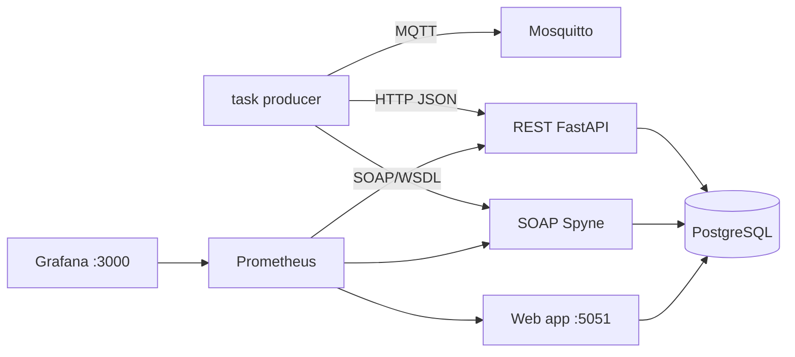

# SSC0158 - Grupo 03

Protótipo funcional para o tema **Serviços Web: SOA, SOAP e REST**, usando um **gerenciador de tarefas (task manager)** como domínio comum para comparar REST e SOAP.

## Objetivo

Comparar, no mesmo caso de uso, o comportamento prático de integração via **REST** e **SOAP** em operações de tarefas, avaliando latência, taxa de sucesso e overhead operacional em cenários controlados.

## Arquitetura implementada



Componentes:

- `collector`: gera eventos sintéticos de tarefas, publica no broker MQTT e encaminha para REST/SOAP.
- `mosquitto`: broker MQTT para evidenciar fluxo de mensagens.
- `rest-service`: API REST em FastAPI com CRUD de tarefas.
- `soap-service`: serviço SOAP com WSDL e operações equivalentes de tarefas.
- `postgres`: armazenamento compartilhado das tarefas.
- `web-app`: dashboard web na porta `5051` com estado das tarefas em tempo real.
- `prometheus` e `grafana`: observabilidade.
- `k6`: gerador de carga usado nos experimentos controlados.

## Execução em 1 comando

```bash
make up
```

Aguarde cerca de 30–60 segundos para os primeiros eventos de tarefa aparecerem.

## Comandos para executar o projeto

Entre na pasta do projeto

Suba todos os serviços:

```bash
make up
```

Verifique se os containers estão ativos:

```bash
docker compose ps
```

Teste a API REST:

```bash
curl http://localhost:8000/health
curl http://localhost:8000/v1/stats
```

Teste o serviço SOAP/WSDL:

```bash
curl http://localhost:8001/?wsdl
```

Verifique se o Prometheus está coletando os serviços:

```bash
curl http://localhost:9090/api/v1/targets
```

Acesse as interfaces no navegador:

```text
Dashboard web: http://localhost:5051
REST Swagger:  http://localhost:8000/docs
SOAP WSDL:     http://localhost:8001/?wsdl
Prometheus:    http://localhost:9090
Grafana:       http://localhost:3000
```

Login do Grafana:

```text
usuário: admin
senha: admin
```

Execute um experimento rápido:

```bash
WORKLOAD=quick SCENARIO_DURATION=5s make final
```

Execute carga maior, com centenas de milhares de requisições:

```bash
WORKLOAD=hundreds make final
```

Esse comando gera os arquivos brutos localmente apenas durante a execução e mantém ao final somente os resultados agregados em `results/tables`, `results/figures` e `results/evidence_runtime.json`.

Acompanhe logs:

```bash
make logs
```

Pare a pilha:

```bash
make down
```

Se `make down` falhar com `permission denied` ao parar containers, reinicie o Docker Snap e derrube a pilha com volumes:

```bash
make down-snap-fix
```

Esse alvo reinicia o Docker Snap, aguarda o daemon voltar e só então executa `docker compose down -v --remove-orphans`.

Recrie o ambiente do zero, removendo volumes do banco e Grafana:

```bash
make down-volumes
make up
```

Limpe apenas os resultados experimentais gerados:

```bash
make clean
```

Se o Docker instalado via Snap travar ao parar containers com `permission denied`, reinicie o daemon e tente novamente:

```bash
make down-snap-fix
make up
```

## Acessos locais

| Serviço | URL |
|---|---|
| Dashboard web | http://localhost:5051 |
| REST Swagger | http://localhost:8000/docs |
| SOAP WSDL | http://localhost:8001/?wsdl |
| Prometheus | http://localhost:9090 |
| Grafana | http://localhost:3000 |

Grafana: usuário `admin`, senha `admin`.

## Domínio task manager

Entidade principal: `Task`.

| Campo | Tipo | Descrição |
|---|---|---|
| `id` | inteiro | Identificador único. |
| `title` | texto | Título da tarefa. |
| `description` | texto | Descrição da tarefa. |
| `status` | texto | `pending`, `done` ou `archived`. |
| `priority` | inteiro | Prioridade de 1 a 5. |
| `protocol` | texto | Protocolo que criou/alterou a tarefa (`REST` ou `SOAP`). |
| `created_at` | timestamp | Data de criação. |
| `updated_at` | timestamp | Data de atualização. |

REST expõe `/v1/tasks` para criação/listagem e `/v1/tasks/{id}` para consulta, atualização e remoção. SOAP expõe operações equivalentes no WSDL: `create_task`, `get_task`, `update_task`, `delete_task` e `list_tasks`.

## Evidências de funcionamento

- eventos brutos do produtor em `data/raw/task_events.csv`;
- amostra versionada em `data/raw/evidence_task_seed.json`;
- registros persistidos em PostgreSQL e visíveis no dashboard;
- exportação CSV em http://localhost:5051/data/export.csv.

## Setup experimental

O gerador de carga é o **k6**, executado em container (`grafana/k6`). Instale apenas as dependências Python usadas para análise estatística e coleta de evidências:

```bash
python3 -m pip install -r experiments/requirements.txt
```

Execute o Projeto completo:

```bash
make final
```

Para ajustar a duração de cada cenário k6:

```bash
make final                 # perfil padrão: dezenas de milhares de requisições
WORKLOAD=quick make final  # teste rápido local
WORKLOAD=hundreds make final  # centenas de milhares de requisições
```

Saídas geradas:

| Saída | Caminho |
|---|---|
| Métricas brutas temporárias do k6 | `results/raw/k6_metrics.json` |
| Dados brutos temporários de latência | `results/raw/experiment_latency.csv` |
| Tabela agregada | `results/tables/summary_metrics.csv` |
| Gráfico de latência com IC95 | `results/figures/latency_ci95.png` |
| Gráfico de taxa de sucesso | `results/figures/success_rate.png` |
| Gráfico de throughput e payload | `results/figures/throughput_payload.png` |
| Evidência de estado da execução | `results/evidence_runtime.json` |

Os arquivos brutos temporários são apagados automaticamente ao fim de `make final` para evitar arquivos locais muito grandes.

## Cenários experimentais

Perfis disponíveis por `WORKLOAD`:

| Perfil | Cenário | Protocolo | Taxa | Duração | Concorrência | Requisições-alvo |
|---|---|---:|---:|---:|---:|---:|
| `quick` | `rest_low`, `rest_medium`, `soap_low`, `soap_medium`, `mixed_medium` | REST/SOAP | 2–8 req/s | `SCENARIO_DURATION` | 2–8 | teste rápido |
| `tens` | `rest_10k` | REST | 500 req/s | 20s | 120 | 10.000 |
| `tens` | `soap_10k` | SOAP | 250 req/s | 40s | 120 | 10.000 |
| `tens` | `mixed_20k` | REST + SOAP | 1.000 req/s | 20s | 240 | 20.000 |
| `hundreds` | `rest_100k` | REST | 1.000 req/s | 100s | 240 | 100.000 |
| `hundreds` | `soap_100k` | SOAP | 500 req/s | 200s | 240 | 100.000 |
| `hundreds` | `mixed_200k` | REST + SOAP | 1.000 req/s | 200s | 480 | 200.000 |

Baseline: `REST`.

Métricas automáticas:

- média;
- desvio padrão;
- IC95;
- percentil 95;
- throughput efetivo em requisições/s;
- tamanho médio do payload enviado;
- esforço de manutenção da interface;
- taxa de sucesso.

## Comandos úteis

```bash
make ps       # lista containers
make logs     # acompanha logs
make down     # encerra a pilha
make clean    # remove saídas experimentais geradas
```

## Estrutura do repositório

```text
├── docker-compose.yml
├── Makefile
├── src/
│   ├── collector/
│   ├── common/
│   ├── rest_service/
│   ├── soap_service/
│   └── web_app/
├── infra/
│   ├── grafana/
│   ├── mosquitto/
│   └── prometheus/
├── experiments/
├── scripts/
├── data/
├── results/
└── docs/
```

## Documentação do Projeto

- `docs/final.md`: setup experimental, arquitetura, métricas e evidências.
- `docs/report_final.md`: texto técnico para incorporar ao relatório.
- `results/preliminary_results.md`: orientação de resultados preliminares.
