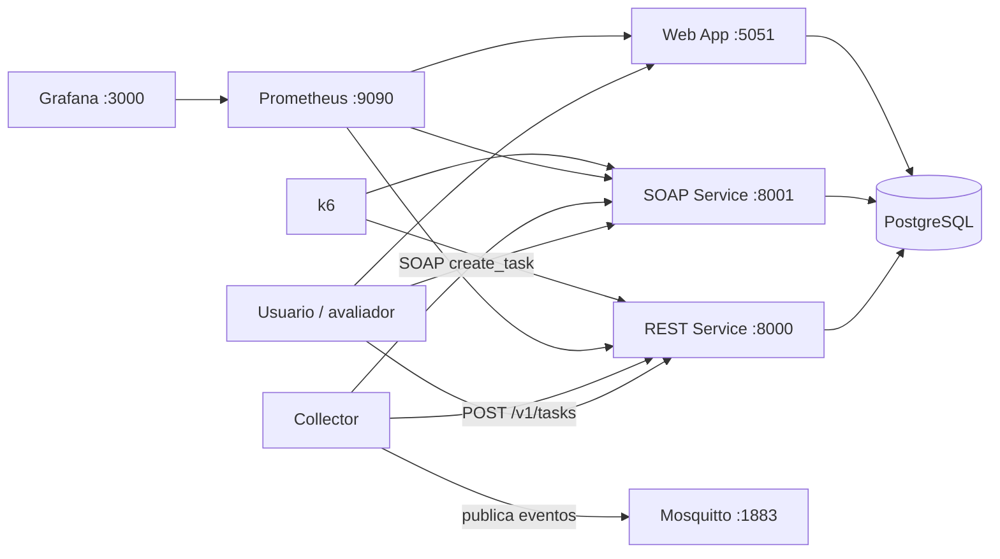
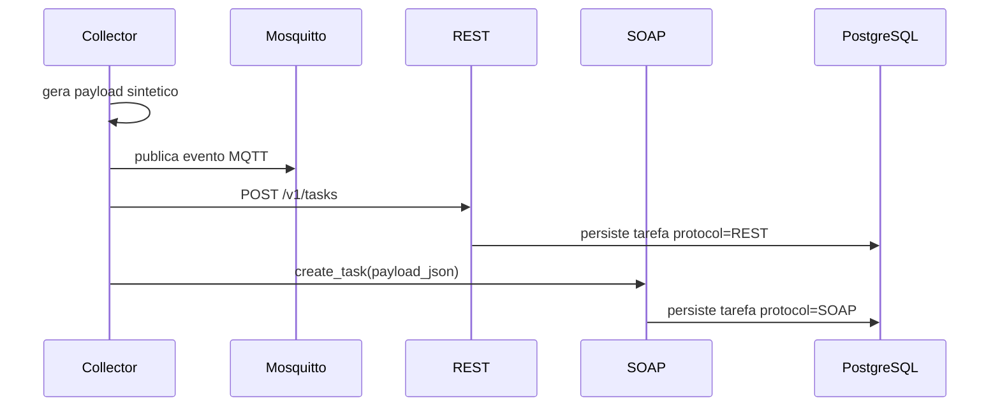
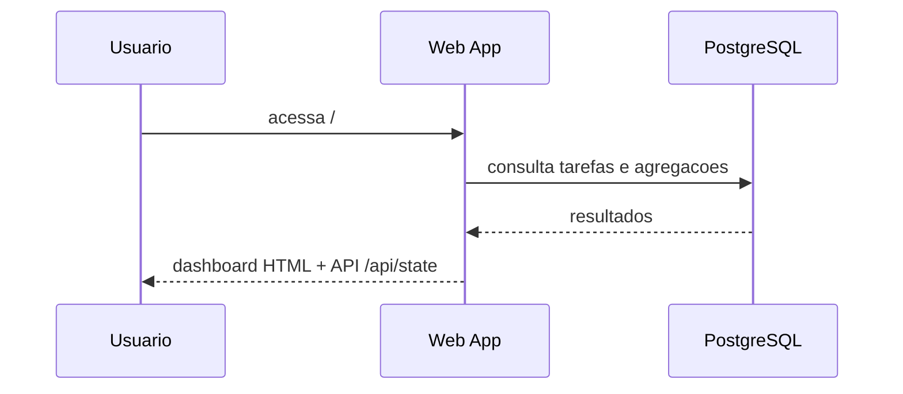
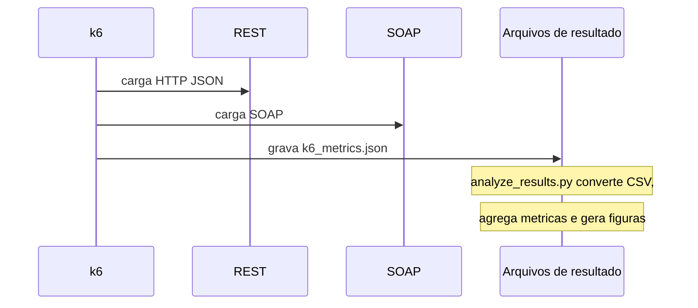

# Arquitetura do Projeto

## Visao geral

Este projeto implementa um prototipo distribuido para comparar servicos **REST** e **SOAP** no mesmo dominio funcional: um gerenciador de tarefas. A aplicacao e orquestrada com Docker Compose e combina persistencia relacional, integracao por mensagens, interfaces HTTP/SOAP, observabilidade e geracao de carga para experimentos.

O objetivo arquitetural e manter um mesmo modelo de dados e a mesma logica de negocio para os dois protocolos, de modo que a diferenca observada entre eles venha principalmente da forma de integracao e do custo de serializacao/contrato.

## Diagrama de alto nivel

## Componentes principais

### PostgreSQL

O banco de dados e o ponto central de persistencia. REST, SOAP e Web App compartilham o mesmo schema e acessam a mesma tabela `tasks`.

Responsabilidades:

- armazenar tarefas criadas via REST e SOAP;
- servir como fonte unica de verdade para consultas e dashboard;
- preservar historico basico por meio dos campos `created_at`, `updated_at` e `raw_payload`.

## Mosquitto

O broker MQTT evidencia o uso de mensageria no sistema. O `collector` publica eventos sinteticos de tarefa no topico configurado, desacoplando a emissao do evento do consumo direto por servicos HTTP.

Responsabilidades:

- receber publicacoes no topico `grupo03/tasks/events`;
- demonstrar integracao orientada a mensagens no prototipo;
- servir como componente de comunicacao assincrona do ecossistema.

## Collector

O `collector` gera tarefas sinteticas periodicamente e executa tres acoes no mesmo ciclo:

- grava o evento bruto em CSV em `data/raw/task_events.csv`;
- publica o evento no broker MQTT;
- encaminha o mesmo payload para REST, SOAP ou ambos, conforme `FORWARD_PROTOCOL`.

Ele funciona como produtor de eventos e como gerador de dados operacionais para o dominio.

## REST Service

O servico REST e implementado com FastAPI e expoe endpoints HTTP/JSON para CRUD de tarefas.

Endpoints principais:

- `GET /health`;
- `POST /v1/tasks`;
- `GET /v1/tasks`;
- `GET /v1/tasks/{task_id}`;
- `PUT /v1/tasks/{task_id}`;
- `DELETE /v1/tasks/{task_id}`;
- `GET /v1/stats`;
- `GET /metrics`.

Responsabilidades:

- validar payloads com Pydantic;
- persistir tarefas com protocolo `REST`;
- expor metricas Prometheus de requisicoes e latencia;
- fornecer endpoints simples para testes manuais e carga automatizada.

## SOAP Service

O servico SOAP e implementado com Spyne e WSGI. Ele expoe contrato WSDL e operacoes equivalentes ao REST, usando XML/SOAP como protocolo de transporte e serializacao.

Operacoes principais:

- `create_task(payload_json)`;
- `get_task(task_id)`;
- `update_task(task_id, payload_json)`;
- `delete_task(task_id)`;
- `list_tasks(limit)`.

Responsabilidades:

- oferecer interface com contrato explicito via WSDL;
- persistir tarefas com protocolo `SOAP`;
- manter equivalencia funcional com o servico REST;
- expor metricas em `/metrics`.

## Web App

O `web-app` e uma interface web simples, obrigatoriamente exposta na porta `5051`, usada para acompanhar o estado do sistema.

Funcionalidades principais:

- exibir total de tarefas;
- separar contagem por protocolo;
- listar tarefas recentes;
- exportar dados como CSV em `/data/export.csv`;
- funcionar como ponto de demonstracao visual do prototipo.

O Web App le diretamente do banco e nao depende de REST ou SOAP para montar seu estado.

## Prometheus e Grafana

Prometheus coleta metricas dos servicos expostos e Grafana consome essas metricas para visualizacao.

Responsabilidades:

- Prometheus: scraping dos endpoints `/metrics`;
- Grafana: dashboards e monitoramento operacional;
- suporte a demonstracoes e analise do comportamento dos servicos em execucao.

## k6

O `k6` e usado apenas no perfil de experimentos e nao faz parte do caminho funcional principal da aplicacao. Ele envia requisicoes controladas para REST e SOAP e grava os resultados brutos em JSON para posterior analise.

Responsabilidades:

- executar workloads `quick`, `tens`, `hundreds` e `millions`;
- controlar taxa de chegada por segundo;
- gerar insumos para o pipeline de analise em `experiments/analyze_results.py`.

## Modelo de dados compartilhado

A tabela principal do sistema e `tasks`, definida em `src/common/models.py`.

Campos relevantes:

- `id`: identificador da tarefa;
- `protocol`: protocolo que criou ou atualizou a tarefa;
- `title`: titulo;
- `description`: descricao;
- `status`: `pending`, `done` ou `archived`;
- `priority`: prioridade de 1 a 5;
- `created_at`: instante de criacao;
- `updated_at`: instante da ultima atualizacao;
- `raw_payload`: payload original serializado em JSON.

Essa modelagem permite comparar REST e SOAP sobre a mesma entidade, sem duplicar logica de persistencia.

## Camada comum

O diretorio `src/common` centraliza o que e compartilhado entre os servicos:

- `db.py`: cria engine SQLAlchemy, pool de conexoes e inicializacao do schema;
- `models.py`: define a entidade `Task`;
- `storage.py`: concentra regras de criacao, atualizacao, normalizacao e serializacao;
- `settings.py`: carrega configuracoes vindas do ambiente.

Essa camada reduz duplicacao entre REST, SOAP e Web App e garante consistencia de dados.

## Fluxos principais

### 1. Fluxo de producao de eventos

### 2. Fluxo de consulta visual

### 3. Fluxo experimental

## Decisoes arquiteturais importantes

### Mesmo dominio para os dois protocolos

REST e SOAP operam sobre a mesma entidade e o mesmo banco. Isso reduz vies na comparacao e evita que diferencas de regra de negocio contaminem o experimento.

### Logica de negocio compartilhada

As operacoes de criacao e atualizacao passam pela camada `src/common/storage.py`. Isso garante consistencia entre servicos e simplifica manutencao.

### Persistencia unica

Todos os consumidores funcionais escrevem e leem do mesmo PostgreSQL. O Web App consulta diretamente o banco para reduzir acoplamento com os servicos de integracao.

### Observabilidade nativa

REST, SOAP e Web App expõem metricas para Prometheus. Isso permite observar disponibilidade e latencia durante demonstracoes e cargas.

### Resultados por run

As execucoes experimentais sao salvas por run em `results/runs/<label>`. Isso evita sobrescrever resultados anteriores e facilita comparacao entre cargas diferentes.

## Portas e contratos externos

| Componente | Porta | Interface |
|---|---:|---|
| Web App | 5051 | HTML + API interna de estado |
| REST Service | 8000 | HTTP/JSON |
| SOAP Service | 8001 | SOAP/WSDL |
| Mosquitto | 1883 | MQTT |
| Prometheus | 9090 | HTTP |
| Grafana | 3000 | HTTP |

## Pastas relevantes

| Caminho | Conteudo |
|---|---|
| `src/common` | Modelo, acesso a banco e logica compartilhada |
| `src/rest_service` | API REST |
| `src/soap_service` | Servico SOAP |
| `src/collector` | Geracao e encaminhamento de eventos |
| `src/web_app` | Dashboard web |
| `infra` | Configuracao de Prometheus, Grafana e Mosquitto |
| `experiments` | Scripts de carga e analise |
| `results` | Saidas experimentais |
| `data` | Dados brutos e processados do dominio |

## Resumo arquitetural

Em termos praticos, a arquitetura pode ser vista em quatro blocos:

- **integracao**: REST, SOAP e MQTT;
- **persistencia**: PostgreSQL;
- **visualizacao e observabilidade**: Web App, Prometheus e Grafana;
- **avaliacao experimental**: k6 e scripts de analise.

Essa divisao permite demonstrar, no mesmo projeto, tanto o funcionamento de uma aplicacao distribuida quanto a comparacao objetiva entre protocolos de servicos web.