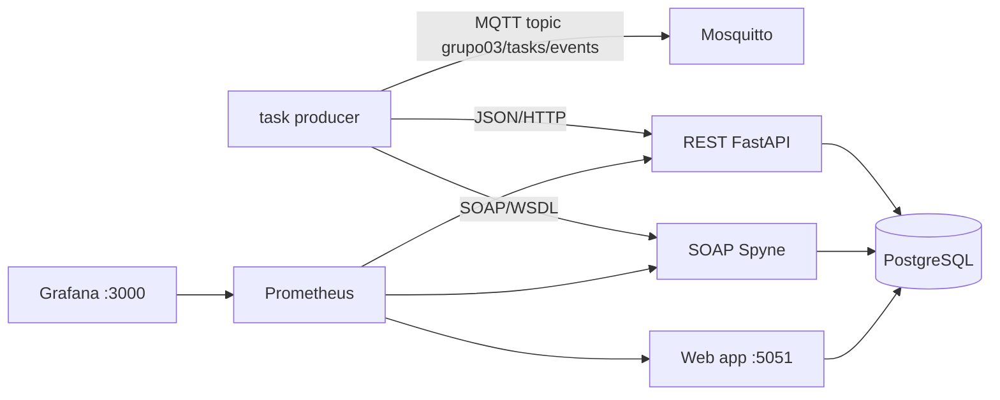

# Checkpoint 3 — Protótipo, setup experimental e evidências

## 1. Escopo implementado

Tema do Grupo 03: **Serviços Web: SOA, SOAP e REST**.

O protótipo implementa uma arquitetura distribuída para comparar integração REST e SOAP usando um **task manager**. O mesmo domínio funcional é exposto nos dois protocolos: criar, consultar, atualizar, listar e remover tarefas com título, descrição, status e prioridade.

## 2. Componentes do protótipo

| Componente | Tecnologia | Função |
|---|---|---|
| `collector` | Python, Paho MQTT, Requests, Zeep | Gera eventos sintéticos de tarefas, publica no broker MQTT e encaminha para REST/SOAP. |
| `mosquitto` | Eclipse Mosquitto | Broker para evidenciar fluxo de mensagens. |
| `rest-service` | FastAPI | API REST para CRUD de tarefas. |
| `soap-service` | Spyne | Serviço SOAP com WSDL para operações equivalentes de tarefas. |
| `postgres` | PostgreSQL 16 | Banco de dados compartilhado para tarefas. |
| `web-app` | FastAPI + HTML | Aplicação web obrigatória, exposta na porta `5051`, com estado das tarefas em tempo real. |
| `prometheus` | Prometheus | Coleta métricas de requisições e latência. |
| `grafana` | Grafana | Dashboard provisionado automaticamente. |
| `k6` | Grafana k6 | Gerador de carga containerizado para cenários REST/SOAP. |

Os containers Python usam `python:3.11-slim`, versão fixada por compatibilidade com a pilha SOAP (`Spyne`).

## 3. Arquitetura



## 4. Setup experimental documentado

### 4.1 Execução do protótipo

```bash
make up
```

Serviços expostos:

- Aplicação web: `http://localhost:5051`
- REST: `http://localhost:8000/docs`
- SOAP WSDL: `http://localhost:8001/?wsdl`
- Prometheus: `http://localhost:9090`
- Grafana: `http://localhost:3000` (`admin`/`admin`)

### 4.2 Domínio funcional

A entidade `Task` possui os campos `id`, `title`, `description`, `status`, `priority`, `protocol`, `created_at` e `updated_at`.

Operações REST:

| Operação | Endpoint |
|---|---|
| Criar tarefa | `POST /v1/tasks` |
| Listar tarefas | `GET /v1/tasks` |
| Consultar tarefa | `GET /v1/tasks/{id}` |
| Atualizar tarefa | `PUT /v1/tasks/{id}` |
| Remover tarefa | `DELETE /v1/tasks/{id}` |

Operações SOAP equivalentes no WSDL:

- `create_task(payload_json)`;
- `get_task(task_id)`;
- `update_task(task_id, payload_json)`;
- `delete_task(task_id)`;
- `list_tasks(limit)`.

### 4.3 Fluxo de eventos

O serviço `collector` atua como produtor de tarefas. A cada ciclo ele:

1. gera uma tarefa sintética;
2. grava o evento bruto em `data/raw/task_events.csv`;
3. publica em `grupo03/tasks/events` no broker MQTT;
4. envia a tarefa ao serviço REST;
5. envia a tarefa ao serviço SOAP;
6. persiste os registros em PostgreSQL com o campo `protocol`.

Uma amostra versionada está em `data/raw/evidence_task_seed.json`.

### 4.4 Protocolo experimental

Variável independente principal: protocolo de integração (`REST`, `SOAP`).

| Perfil | Cenário | Protocolo | Taxa | Duração | Concorrência | Requisições-alvo |
|---|---|---:|---:|---:|---:|---:|
| `quick` | `rest_low`, `rest_medium`, `soap_low`, `soap_medium`, `mixed_medium` | REST/SOAP | 2–8 req/s | configurável | 2–8 | teste rápido |
| `tens` | `rest_10k` | REST | 500 req/s | 20s | 120 | 10.000 |
| `tens` | `soap_10k` | SOAP | 250 req/s | 40s | 120 | 10.000 |
| `tens` | `mixed_20k` | REST + SOAP | 1.000 req/s | 20s | 240 | 20.000 |
| `hundreds` | `rest_100k` | REST | 1.000 req/s | 100s | 240 | 100.000 |
| `hundreds` | `soap_100k` | SOAP | 500 req/s | 200s | 240 | 100.000 |
| `hundreds` | `mixed_200k` | REST + SOAP | 1.000 req/s | 200s | 480 | 200.000 |

Métricas dependentes:

- latência por requisição em milissegundos;
- taxa de sucesso;
- throughput efetivo em requisições/s;
- tamanho médio do payload enviado;
- esforço de manutenção da interface, estimado por pontuação de operações, campos e artefatos de contrato;
- percentil 95 de latência;
- média, desvio padrão e IC95;
- volume de tarefas persistidas por protocolo.

Baseline: `REST` é o baseline comparativo por ser a alternativa mais simples e comum em APIs web modernas.

### 4.5 Execução dos experimentos

```bash
python3 -m pip install -r experiments/requirements.txt
make checkpoint3
WORKLOAD=hundreds make checkpoint3
```

O alvo `make checkpoint3` executa o k6 em container com `WORKLOAD=tens` por padrão, gerando dezenas de milhares de requisições. Para uma rodada de centenas de milhares, usar `WORKLOAD=hundreds make checkpoint3`. O pipeline gera `results/raw/k6_metrics.json`, converte as métricas para `results/raw/experiment_latency.csv` e produz tabelas/figuras estatísticas.

Saídas:

- métricas brutas do k6: `results/raw/k6_metrics.json`;
- dados brutos convertidos: `results/raw/experiment_latency.csv`;
- tabela agregada: `results/tables/summary_metrics.csv`;
- gráficos: `results/figures/latency_ci95.png`, `results/figures/success_rate.png` e `results/figures/throughput_payload.png`;
- evidência de execução: `results/evidence_runtime.json`.

## 5. Resultados preliminares esperados

A execução preliminar deve verificar:

1. se ambos os protocolos persistem tarefas corretamente;
2. se o dashboard web atualiza contadores em tempo real;
3. se o MQTT recebe eventos de tarefa do produtor;
4. se REST apresenta menor overhead médio que SOAP em cenários equivalentes;
5. se SOAP mantém vantagem de contrato explícito via WSDL, apesar de maior complexidade operacional.

## 6. Evidências implementadas

- `collector` registra `task_events.csv` com carimbo temporal local;
- `data/raw/evidence_task_seed.json` contém amostra do payload de tarefa;
- `web-app` exporta CSV de tarefas persistidas;
- `scripts/collect_evidence.py` gera JSON com contadores e estado dos serviços;
- Prometheus registra séries temporais de requisições e latência.

## 7. Limitações atuais

- As tarefas são sintéticas para manter controle experimental e reprodutibilidade.
- O experimento de carga cria novas tarefas para isolar overhead de protocolo.
- O Grafana provisionado foca métricas Prometheus; gráficos estatísticos finais são gerados por Matplotlib.
- A geração de carga usa k6 em container para evitar dependência de ferramentas instaladas diretamente no host.
