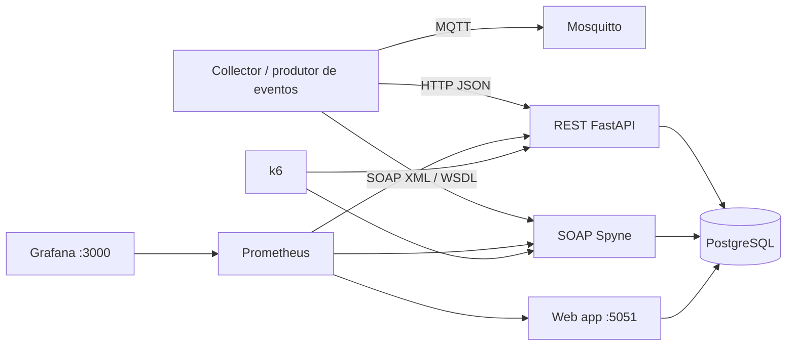

# Relatorio tecnico - Projeto

## 1. Tema e objetivo

O projeto do Grupo 03 aborda o tema **Servicos Web: SOA, SOAP e REST** por meio de um prototipo distribuido de gerenciamento de tarefas. O objetivo do Projeto e comparar, em um mesmo dominio funcional, o comportamento de integracoes REST e SOAP sob cargas controladas.

O experimento mede:

- latencia media e percentil 95;
- intervalo de confianca de 95% da latencia media;
- throughput efetivo;
- taxa de sucesso;
- tamanho medio do payload;
- pontuacao aproximada de manutencao da interface.

## 2. Prototipo implementado

O sistema implementa um **task manager** com operacoes equivalentes em REST e SOAP. A entidade principal e `Task`, composta por `id`, `title`, `description`, `status`, `priority`, `protocol`, `created_at` e `updated_at`.

### 2.1 Componentes

| Componente | Tecnologia | Responsabilidade |
|---|---|---|
| `rest-service` | FastAPI | API REST para criacao, consulta, atualizacao, listagem e remocao de tarefas. |
| `soap-service` | Spyne + Gunicorn | Servico SOAP com WSDL e operacoes equivalentes as do REST. |
| `postgres` | PostgreSQL 16 | Persistencia compartilhada das tarefas. |
| `collector` | Python, MQTT, Requests, Zeep | Geracao de eventos sinteticos e encaminhamento para REST/SOAP. |
| `mosquitto` | Eclipse Mosquitto | Broker MQTT para evidenciar fluxo de mensagens. |
| `web-app` | FastAPI + HTML | Interface web na porta `5051` para visualizacao das tarefas. |
| `prometheus` | Prometheus | Coleta de metricas dos servicos. |
| `grafana` | Grafana | Dashboard de observabilidade. |
| `k6` | Grafana k6 | Geracao de carga nos experimentos. |

### 2.2 Arquitetura



## 3. Interfaces expostas

### 3.1 REST

| Operacao | Endpoint |
|---|---|
| Criar tarefa | `POST /v1/tasks` |
| Listar tarefas | `GET /v1/tasks` |
| Consultar tarefa | `GET /v1/tasks/{task_id}` |
| Atualizar tarefa | `PUT /v1/tasks/{task_id}` |
| Remover tarefa | `DELETE /v1/tasks/{task_id}` |

### 3.2 SOAP

O servico SOAP expoe WSDL em `http://localhost:8001/?wsdl` com as operacoes:

- `create_task(payload_json)`;
- `get_task(task_id)`;
- `update_task(task_id, payload_json)`;
- `delete_task(task_id)`;
- `list_tasks(limit)`.

## 4. Setup experimental

O gerador de carga e o k6 executado em container. O script utiliza o executor `constant-arrival-rate`, que controla a taxa de chegada de requisicoes por segundo. Assim, os VUs representam capacidade reservada para sustentar a taxa configurada, e nao a metrica principal do teste.

Os cenarios sao executados sequencialmente por padrao para reduzir interferencia entre REST e SOAP em uma VM compartilhada. Antes da carga, o script verifica se REST e SOAP estao prontos; essas requisicoes de prontidao sao filtradas na analise para nao aparecerem como protocolo `UNKNOWN`.

## 5. Workloads configurados

| Workload | Cenarios | Taxa planejada | Duracao | Alvo aproximado |
|---|---|---:|---:|---:|
| `quick` | `rest_low`, `soap_low` | 2 req/s | configuravel por `SCENARIO_DURATION` | validacao rapida |
| `quick` | `rest_medium`, `soap_medium` | 8 req/s | configuravel por `SCENARIO_DURATION` | validacao rapida |
| `quick` | `mixed_medium` REST/SOAP | 4 req/s por protocolo | configuravel por `SCENARIO_DURATION` | validacao rapida |
| `tens` | `rest_10k`, `soap_10k` | 50 req/s | 200s | 10.000 por protocolo |
| `tens` | `mixed_20k` REST/SOAP | 25 req/s por protocolo | 400s | 10.000 por protocolo |
| `hundreds` | `rest_100k`, `soap_100k` | 40 req/s | 2500s | 100.000 por protocolo |
| `hundreds` | `mixed_200k` REST/SOAP | 20 req/s por protocolo | 5000s | 100.000 por protocolo |
| `millions` | `rest_1m`, `soap_1m` | 60 req/s | 16667s | 1.000.000 por protocolo |
| `millions` | `mixed_2m` REST/SOAP | 30 req/s por protocolo | 33334s | 1.000.000 por protocolo |

Os workloads `hundreds` e `millions` sao perfis de estresse de longa duracao. As conclusoes deste relatorio usam os runs da VM `quick-final` e `tens-final`, que possuem REST e SOAP completos e 100% de sucesso.

## 6. Organizacao dos runs usados

Os resultados usados neste relatorio foram gerados diretamente na VM e copiados para a pasta `runs/` do projeto:

| Run | Tabela | Figuras |
|---|---|---|
| `quick-final` | [../runs/quick-final/tables/summary_metrics.csv](../runs/quick-final/tables/summary_metrics.csv) | [latencia](../runs/quick-final/figures/latency_ci95.png), [sucesso](../runs/quick-final/figures/success_rate.png), [throughput/payload](../runs/quick-final/figures/throughput_payload.png) |
| `tens-final` | [../runs/tens-final/tables/summary_metrics.csv](../runs/tens-final/tables/summary_metrics.csv) | [latencia](../runs/tens-final/figures/latency_ci95.png), [sucesso](../runs/tens-final/figures/success_rate.png), [throughput/payload](../runs/tens-final/figures/throughput_payload.png) |

Cada run contem tambem as metricas brutas do k6 (`raw/k6_metrics.json`) e o CSV convertido de latencias (`raw/experiment_latency.csv`).

## 7. Validacao dos dados

O script de analise valida os resultados antes de gerar as tabelas e graficos. A rodada e rejeitada quando faltam cenarios esperados, quando algum protocolo tem 0% de sucesso ou quando o volume entregue fica abaixo do alvo esperado. Essa validacao evita usar resultados parciais, por exemplo um arquivo contendo somente REST ou somente SOAP.

Nos runs usados neste relatorio:

- `quick-final` contem os seis cenarios esperados: REST e SOAP em baixa carga, media carga e cenario misto;
- `tens-final` contem os quatro cenarios esperados: REST 10k, SOAP 10k e misto REST/SOAP 20k;
- todos os cenarios tiveram 100% de sucesso;
- as linhas de prontidao (`setup_probe`) nao foram consideradas nas metricas finais.

## 8. Resultados do run `quick-final`


| Cenario | Protocolo | Taxa planejada | Requisicoes | Sucesso | Throughput efetivo | Payload medio | Latencia media | IC95 | P95 |
|---|---|---:|---:|---:|---:|---:|---:|---:|---:|
| `mixed_medium` | REST | 4 req/s | 41 | 100,0% | 4,10 req/s | 244,32 B | 21,98 ms | 1,64 ms | 26,89 ms |
| `mixed_medium` | SOAP | 4 req/s | 41 | 100,0% | 4,10 req/s | 668,39 B | 45,42 ms | 8,75 ms | 80,02 ms |
| `rest_low` | REST | 2 req/s | 21 | 100,0% | 2,10 req/s | 242,38 B | 18,20 ms | 2,95 ms | 23,38 ms |
| `rest_medium` | REST | 8 req/s | 80 | 100,0% | 8,11 req/s | 243,35 B | 20,26 ms | 1,06 ms | 24,97 ms |
| `soap_low` | SOAP | 2 req/s | 21 | 100,0% | 2,11 req/s | 666,38 B | 52,83 ms | 13,13 ms | 91,49 ms |
| `soap_medium` | SOAP | 8 req/s | 81 | 100,0% | 8,14 req/s | 668,30 B | 37,42 ms | 5,75 ms | 79,80 ms |

No run `quick-final`, ambos os protocolos responderam corretamente. REST apresentou menor latencia media em todos os pares comparaveis, enquanto SOAP teve payload medio aproximadamente 2,7 vezes maior. A diferenca fica clara no cenario `mixed_medium`: REST teve latencia media de 21,98 ms, enquanto SOAP teve 45,42 ms.

## 9. Resultados do run `tens-final`


| Cenario | Protocolo | Taxa planejada | Requisicoes | Sucesso | Throughput efetivo | Payload medio | Latencia media | IC95 | P95 |
|---|---|---:|---:|---:|---:|---:|---:|---:|---:|
| `mixed_20k` | REST | 25 req/s | 10001 | 100,0% | 25,00 req/s | 247,78 B | 20,55 ms | 0,09 ms | 25,58 ms |
| `mixed_20k` | SOAP | 25 req/s | 10001 | 100,0% | 25,01 req/s | 673,07 B | 24,08 ms | 0,38 ms | 73,63 ms |
| `rest_10k` | REST | 50 req/s | 10001 | 100,0% | 50,00 req/s | 247,07 B | 17,88 ms | 0,10 ms | 26,42 ms |
| `soap_10k` | SOAP | 50 req/s | 10001 | 100,0% | 50,04 req/s | 671,77 B | 18,45 ms | 0,31 ms | 60,66 ms |

No run `tens-final`, REST e SOAP atingiram o volume planejado e mantiveram 100% de sucesso. O throughput efetivo ficou praticamente igual a taxa configurada. REST manteve payload medio proximo de 247 bytes; SOAP ficou proximo de 672 bytes.

Em latencia media, REST foi levemente melhor no cenario isolado (`17,88 ms` contra `18,45 ms`) e tambem no cenario misto (`20,55 ms` contra `24,08 ms`). A diferenca mais relevante aparece no P95: SOAP chegou a `60,66 ms` no `soap_10k` e `73,63 ms` no `mixed_20k`, enquanto REST ficou abaixo de `27 ms` nos dois casos.

## 10. Manutencao da interface

A pontuacao de manutencao foi usada como uma aproximacao simples e reprodutivel: operacoes publicas + campos funcionais + artefatos de contrato/interface.

| Protocolo | Pontos | Interpretacao |
|---|---:|---|
| REST | 13 | Operacoes CRUD, campos do payload, schemas Pydantic e OpenAPI gerado. |
| SOAP | 15 | Operacoes CRUD, campos do payload, RPC Spyne, WSDL, envelope XML e binding SOAP. |

SOAP possui maior formalizacao de contrato, o que pode ser util em integracoes corporativas. Entretanto, isso tambem aumenta o numero de artefatos e o custo de manutencao da interface.

## 11. Discussao

Os resultados confirmam a expectativa de que REST tende a ser mais leve em chamadas simples baseadas em JSON. Isso aparece principalmente no tamanho medio do payload: nas rodadas da VM, SOAP transmitiu aproximadamente 2,7 vezes mais bytes por requisicao do que REST.

Em termos de latencia, REST apresentou menor media em todos os pares comparaveis. No workload `tens-final`, a media de SOAP no cenario isolado ficou muito proxima da de REST, mas o P95 de SOAP foi mais alto, indicando maior cauda de latencia. Essa diferenca e importante porque o P95 representa melhor a experiencia em momentos de pior resposta do que a media isolada.

O throughput efetivo ficou alinhado com as taxas planejadas, e todos os cenarios dos runs analisados tiveram 100% de sucesso. Portanto, dentro da carga validada, os dois protocolos funcionaram corretamente; a principal diferenca observada foi eficiencia de payload e estabilidade da cauda de latencia.

## 12. Limitacoes

- A carga e sintetica e baseada principalmente em criacao de tarefas.
- O ambiente usa uma unica VM, entao CPU, disco, rede e banco podem influenciar os resultados.
- Os workloads `hundreds` e `millions` foram configurados, mas nao sao tratados como resultado validado neste relatorio.
- O experimento e um benchmark controlado, nao uma simulacao completa de producao.
- Uma avaliacao futura poderia misturar criacoes, leituras, atualizacoes e remocoes em proporcoes mais proximas de uso real.

## 13. Reprodutibilidade

Comandos principais para reproduzir os runs usados:

```bash
make up

WORKLOAD=quick RUN_LABEL=quick-final SCENARIO_DURATION=10s make experiment
WORKLOAD=quick RUN_LABEL=quick-final make analyze-docker

WORKLOAD=tens RUN_LABEL=tens-final make experiment
WORKLOAD=tens RUN_LABEL=tens-final make analyze-docker
```

Na VM usada no experimento, a execucao foi feita a partir de `/tmp` para evitar falhas de bind mount do Docker em diretorios home.

## 14. Conclusao

O Projeto entregou um prototipo funcional com REST, SOAP, MQTT, banco de dados, interface web e observabilidade. O setup experimental permitiu gerar cargas controladas, preservar os resultados de cada run e produzir tabelas e figuras comparativas.

Nos runs da VM `quick-final` e `tens-final`, REST e SOAP completaram todos os cenarios esperados com 100% de sucesso. REST apresentou menor payload e menor latencia media nas comparacoes diretas. SOAP manteve funcionamento correto, mas com maior tamanho de payload e P95 mais elevado, refletindo o custo adicional do envelope XML e do contrato WSDL.

Assim, para o dominio avaliado, REST foi a alternativa mais eficiente em desempenho e simplicidade operacional. SOAP continua sendo relevante em contextos nos quais contrato formal, interoperabilidade baseada em WSDL e governanca de interface sejam requisitos mais importantes do que leveza de payload.
